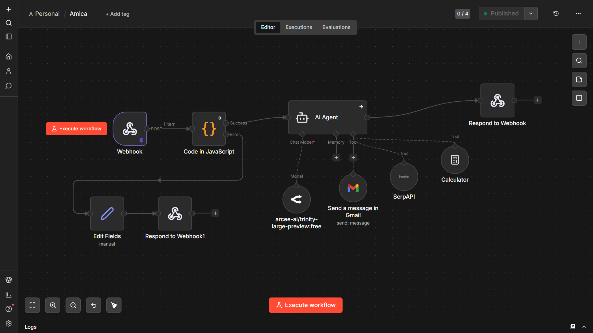

# Amica.ai

Amica is an AI-powered automation system built using n8n that processes user input, generates responses, and can perform actions like sending emails based on user commands.

## Live Demo

You can interact with Amica here:  
👉 https://amica.onesite.co.in

## Overview

This project demonstrates how real-world automation systems can be built by integrating webhooks, APIs, and workflow logic. Instead of a traditional backend server, Amica uses n8n to handle the entire processing pipeline.

## How It Works

1. User submits input through a frontend interface
2. Data is sent to an n8n webhook endpoint
3. The workflow processes the input
4. OpenRouter API is used (when available) to generate a response
5. If the user requests a specific action (like sending an email), the workflow triggers it
6. Final response is returned to the user

## Features

* AI-based response generation
* Workflow automation using n8n
* Webhook-based data handling
* User-triggered actions (e.g., sending emails through workflow)

## Tech Stack

* n8n (workflow automation)
* Webhooks (data intake)
* APIs (AI processing)
* Email integration (via workflow node)
* Basic frontend interface

## Key Learnings

* Understanding webhook-based architectures
* Working with API integrations
* Designing backend logic using workflows instead of traditional servers
* Handling conditional actions based on user input

## Limitations

* Webhook Secret is publicly accessible and may be misused
* No persistent memory implemented for the AI agent  
* The system does not retain previous user context between requests  
* This is due to local resource constraints and to keep the workflow lightweight  
* No authentication or rate limiting implemented yet
* System is in a prototype stage

## Future Improvements

* Add authentication layer (token validation)
* Implement rate limiting and request validation
* Move sensitive handling fully to backend logic
* Improve workflow robustness and error handling

## Status

Prototype / Learning Project

## Workflow Architecture

Below is the backend workflow built using n8n:

The workflow starts with a webhook, processes input through an AI agent, and conditionally triggers actions such as email sending or external API calls before returning a response.

## Workflow Export

The complete n8n workflow is available in JSON format:

- [See workflow.json](./workflow.json)

## Future Improvements (Currently Working On)

- Implement session-based or persistent memory for better context retention  
- Optimize resource usage to support memory without affecting system performance  
